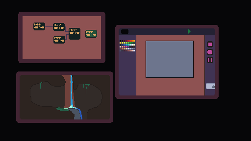

# Game Engine

For the computer science project, a game engine will (hopefully be made).

My goals for this project are:

  + Make a tool that people can use to make games.
  + Have almost all pixels simulated at runtime.
  + Create an asset editor (for art mainly).
  + Create a beginner friendly programming language to interact with the games being created.



## First Notes

Making a game engine is a lot of work, however, there are lots of in depth aspects to it as the mark scheme requires. Despite having made a 3D renderer before, it's a lot of work and getting collision working in 3D would be even more work and not contribute to the time, therefore making a 2D engine is a better use of the given time. There are many 2D game engines out there so making one that stands out would be quite difficult. An engine I find quite interesting is the [falling everything engine](https://nollagames.com/fallingeverything/) which has every pixel simulated and looks *really* cool. Making an engine like this would leave lots of room for prototyping due to the immense amount of optimisation required. It would also use cellular automata which would make graphics a lot easier to create as it doesn't have to be made in other software and can be created through terrain simulation. This would combine physics and maths into a large computer programming project that can be developed after graduating and can be used by many people who are looking into the game development career. It would be a tool to make unique interesting games as free game engines don't have this feature yet.

  Making a programming language to interface with the language would also be quite a large task but making a block programming language would be easier to program and easier to learn and use by consumers. The project should be left open source however, to allow people to add their own features if the in-built language does not provide their needs. The engine should be accessible to new developers and have enough capabilities and features for seasoned developers. This would encourage more people to use the engine and also make it useable in education settings. The code should also be compiled and optimised before running the game however it might be best for the program to interpret the code so that consumers don't have to wait for it to finish compiling every time they want to test a feature.

  Collision detection is quite a key feature of a game engine. The collision detection shouldn't restrict what consumers can do and should also include options that send signals to code to be run when a certain collision happening rather than the game engine handling everything and restricting the use of the engine.
  The Pixel Art program (if the game engine is built like the [falling everything engine](https://nollagames.com/fallingeverything/)) should have colour options, animation options and physics options as the pixels could be simulated to fall, summon other pixels and stick to other pixels (or stay in place) etc. It should have an accessible UI as it is a tool that can be used in educational settings.
  
  The downsides of using the programming language Rust for this this project is that there is a lack of easy APIs for GPUs which would be a path for accelerating program speed capabilities. The upsides are: I already know the language, it is easy to maintain programs written in this language, it relies on structured code like structs and functions (no pesky mutable globals) which are needed for higher marks, it's fast speed and memory safety.

  I will be using a rust crate (library) called minifb to handle the window for the engine. It also has handles for keyboard and mouse which makes life easier when making player controls (and UI controls).

## Project Plan

The project can be broken up into different areas like so:

```
game_engine
|-- physics_engine
|   |-- collision
|   |-- forces
|   |   `-- gravity
|   `-- types
|       |-- free
|       |-- glue
|       `-- static
|-- pixelart_editor
|   |-- animation
|   |-- brushtools
|   |-- colours
|   |-- exporting
|   `-- simulation
|-- programming_language
|   |-- API
|   |-- gui
|   |   |-- boxes
|   |   `-- connections
|   |-- lexer
|   `-- syntax
|-- render_engine
|   |-- effects
|   `-- pixel_to_buffer
`-- window_manager
    |-- bars
    |-- buttons
    |-- menus
    |-- resizing
    |-- widgets
    `-- windows
```

This is quite a large task tree but by doing one part of it at a time the project will be less stressful to make.

1. Window manager
  the window manager will be made first as it will be the core part of the game engine (it allows developers to interact with the program).
2. Render engine
  the render engine should be made second as it is used to render the core part of the game engine (pixels).
3. Physics engine
  the physics engine will be made afterwards as it is needed for the simulation feature of the pixelart editor.
4. Pixelart editor
  this will be made 4th as the rest of its foundations have already been made.
5. Programming language
  this will be made last as it is one of the largest parts of the game engine and will act as a cherry on top.


## Deciding on a methodology

There are 5 common methodologies to choose from; Those being: Waterfall, Rad, Spiral, Agile and Extreme.

The topics to consider are:
  + Stakeholders
  + Feasibility, Fact Finding methods used
  + Requirements Spec
  + Design Stage
  + Testing methods and documentation
  + The 4 methods of implementation
  + User and Technical documentation

### Waterfall method

The waterfall methodology has many flaws. It relies on each step being completed in order and once a step is complete, it cannot be changed. This means if a product does not meet the buyers demands then at its development-end then it has to be scrapped and restarted. You ask the buyer for the requirements once then design the product then implement, test  and deploy all without checking if any of those steps were what the buyer wanted. The buyer cannot change their mind about the product and the buyer doesn't get to check the product until it is finished. Bad.

### Rapid Application Development

A very cool methodology (you could call it rad), that gets every stage working together throughout development. The buyer (stakeholder) gives the requirements and then the project is planned. After the first prototype (of any section of the project as it is split into multiple parts) the buyer looks at the product and tells them what needs to change. After that the plan is changed and another prototype is made and repeat and so on. This keeps happening until a set time or the buyer is out of money or happy with the end product.

### Spiral

The spiral methodology is like the rad methodology except it repeats every stage sequentially and has less communication.

### Agile

Literally the exact same as rad...

### Extreme

Sections can be repeated without going back to the very start. Programming is done in pairs too which allows for new employees to be coached.


